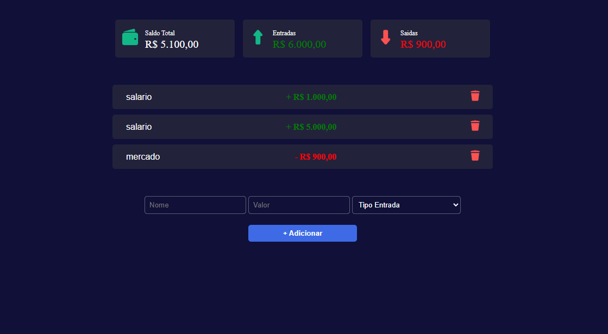

# 💰 Controle Financeiro

Aplicação web para gerenciamento de finanças pessoais, permitindo registrar entradas e saídas de forma simples, rápida e visual.

---

## 📸 Demonstração



---

## 🚀 Funcionalidades

- Adicionar transações (entrada e saída)
- Exibir saldo total atualizado
- Separação de entradas e saídas
- Remover transações
- Persistência de dados com localStorage
- Interface responsiva (mobile e desktop)

---

## 🛠️ Tecnologias

- HTML5
- CSS3
- JavaScript (Vanilla JS)

---

## 📱 Responsividade

Interface adaptada para:
- Mobile
- Desktop

---

## ▶️ Como executar

1. Clone o repositório:
```bash
git clone https://github.com/seu-usuario/seu-repositorio.git
